# LIRS (and its modification, DLIRS) compared to LRU, ARC, and OPT (as a baseline)

<h2 align="center">Twitter Dataset</h2>

<table width="100%">
  <tr>
    <td width="100%">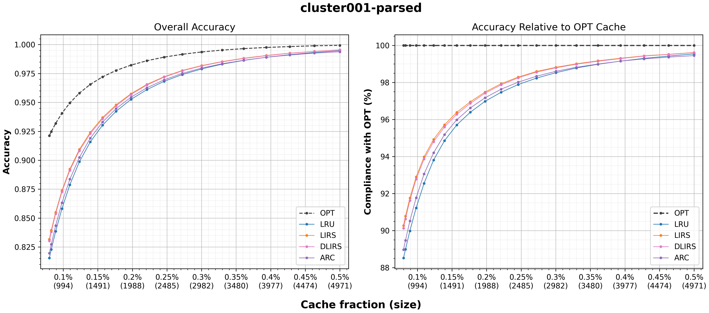</td>
  </tr>
  <tr>
    <td width="100%">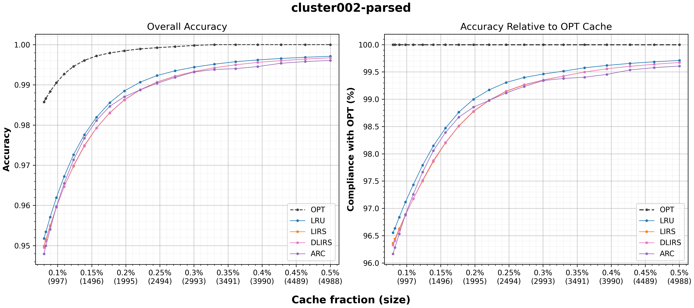</td>
  </tr>
  <tr>
    <td width="100%">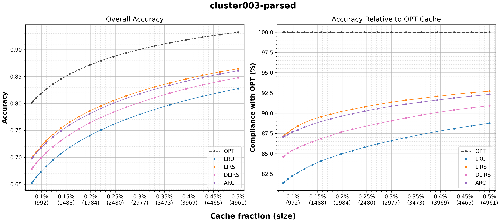</td>
  </tr>
  <tr>
    <td width="100%">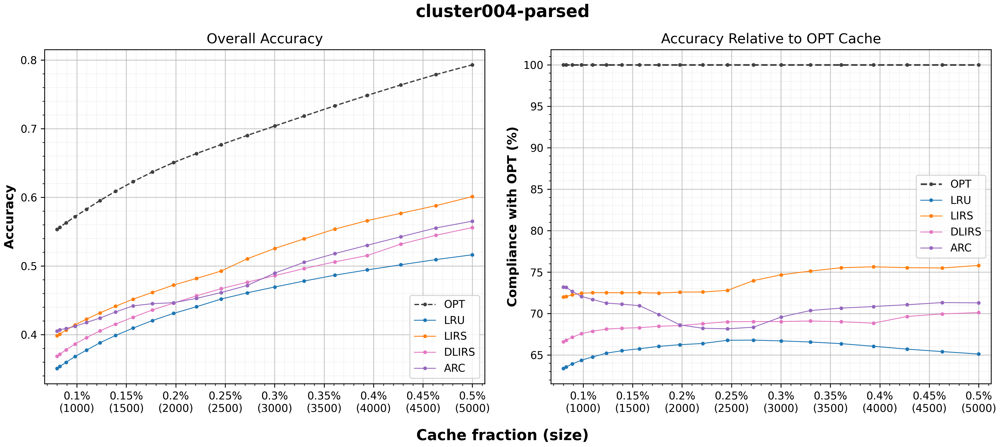</td>
  </tr>
  <tr>
    <td width="100%">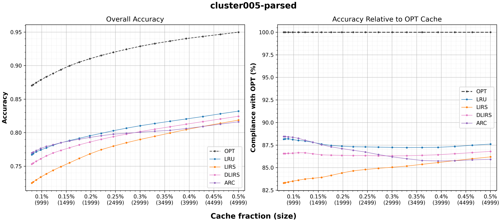</td>
  </tr>
  <tr>
    <td width="100%">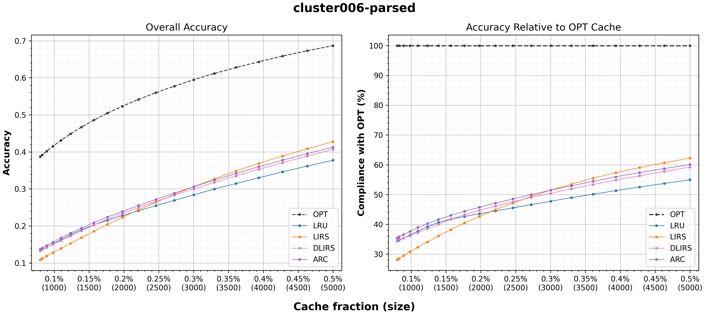</td>
  </tr>
  <tr>
    <td width="100%">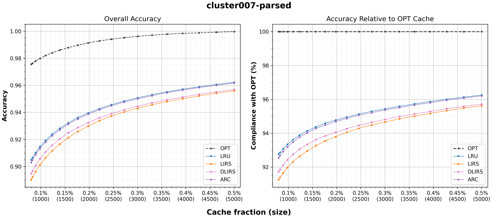</td>
  </tr>
  <tr>
    <td width="100%">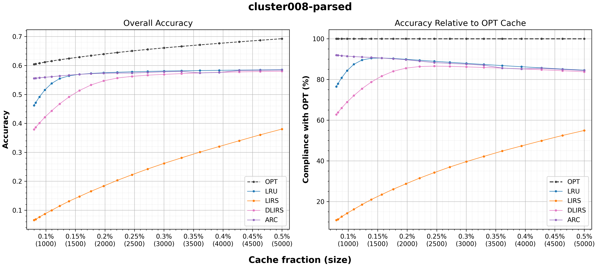</td>
  </tr>
  <tr>
    <td width="100%">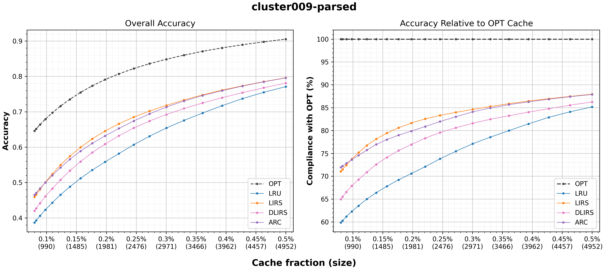</td>
  </tr>
  <tr>
    <td width="100%">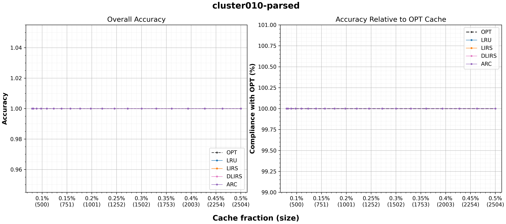</td>
  </tr>
  <tr>
    <td width="100%">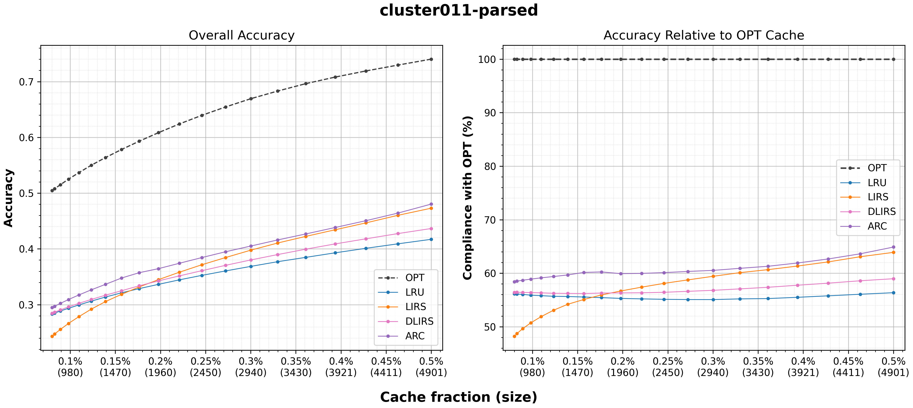</td>
  </tr>
  <tr>
    <td width="100%">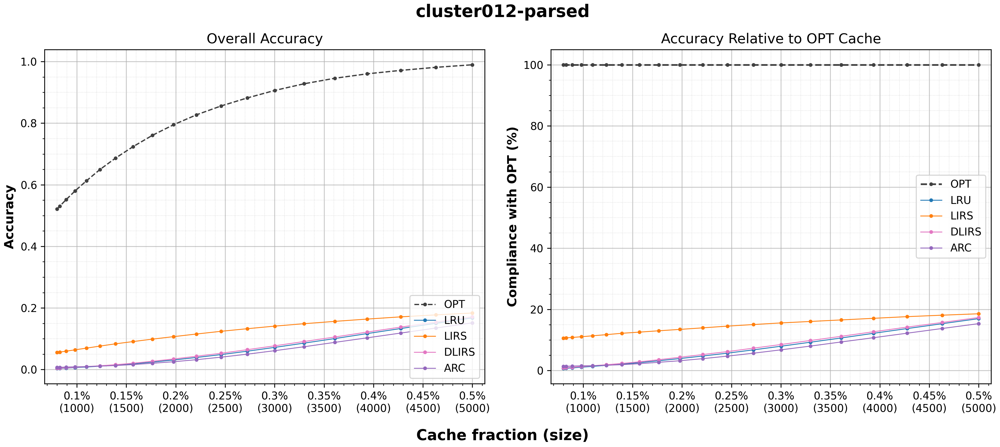</td>
  </tr>
  <tr>
    <td width="100%">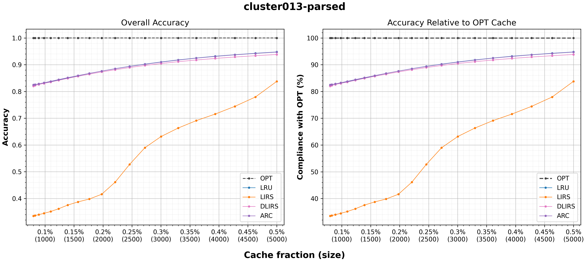</td>
  </tr>
  <tr>
    <td width="100%">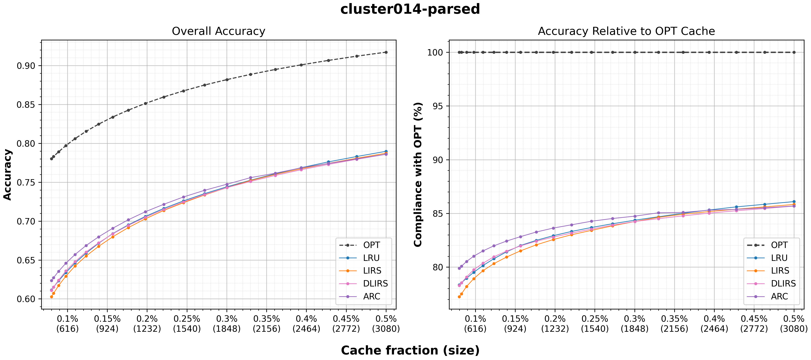</td>
  </tr>
  <tr>
    <td width="100%">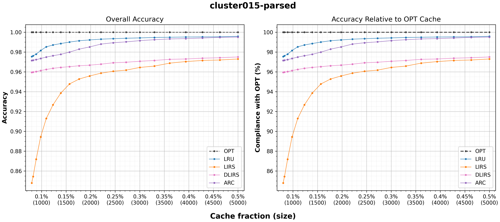</td>
  </tr>
  <tr>
    <td width="100%">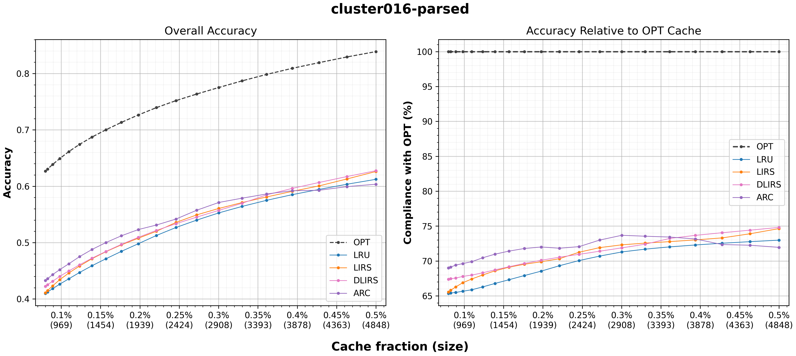</td>
  </tr>
  <tr>
    <td width="100%">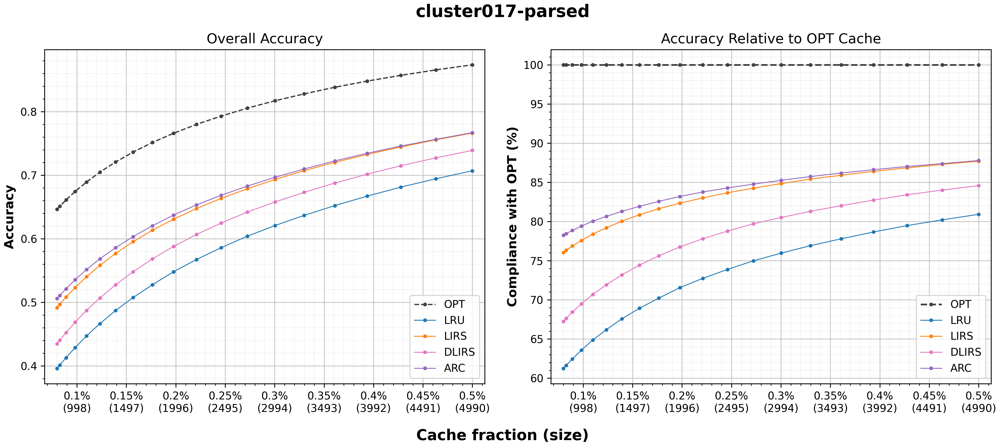</td>
  </tr>
  <tr>
    <td width="100%">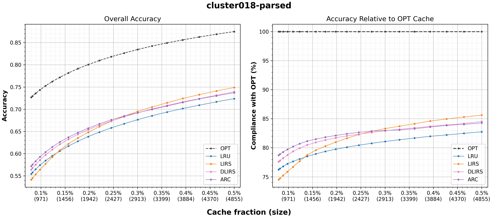</td>
  </tr>
  <tr>
    <td width="100%">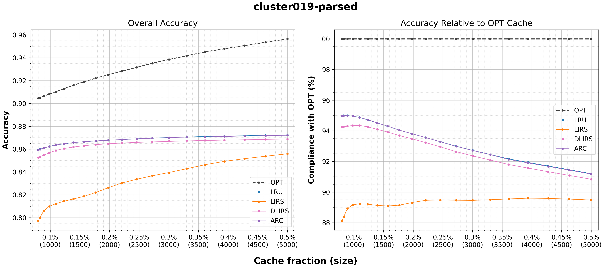</td>
  </tr>
  <tr>
    <td width="100%">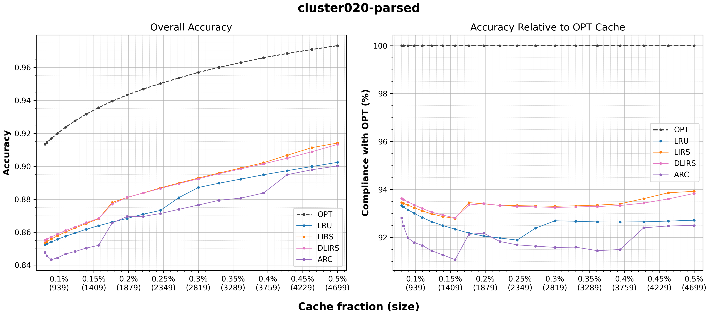</td>
  </tr>
</table>